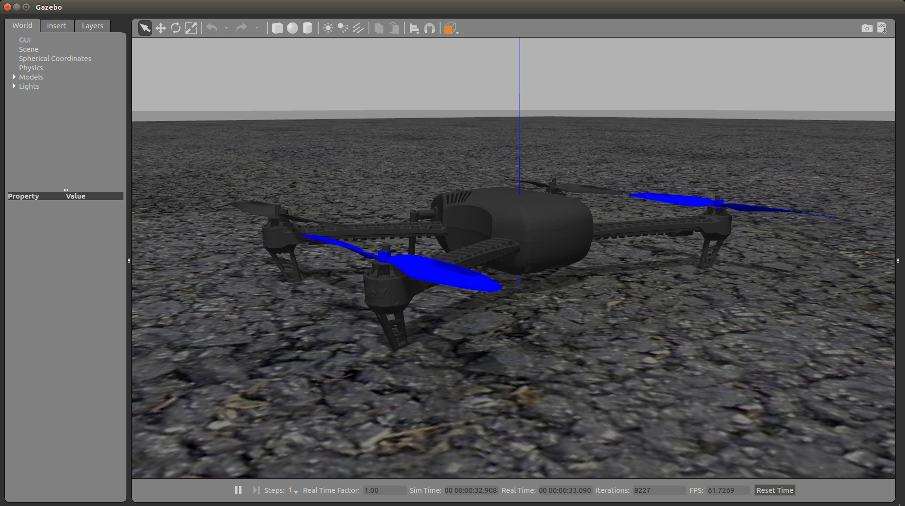

With the [community bonding](googlesummerofcode.blogspot.com/2007/04/so-what-is-this-community-bonding-all.html) period coming to an end, this post details the main outputs of my work till now.

## Usage of PX4 and MAVROS

As the project requires the knowledge of the usage of MAVROS and PX4, I built this up by figuring out how to install these as documented [here](../2019-05-28-installation_things_2/).

Using the [MAVROS C++ documentation example](http://dev.px4.io/en/ros/mavros_offboard.html) and the [python integration tests](http://dev.px4.io/en/ros/mavros_offboard.html), I was able to write my own Python node commanding the position of an iris drone simulated in Gazebo as shown in the below video (click on the image):

The code for reproducing the above video is available at the [github repository](https://github.com/TheRoboticsClub/colab-gsoc2019-Nikhil_Khedekar/blob/master/catkin_ws/src/drone_exercises/src/offb_position_control.py).