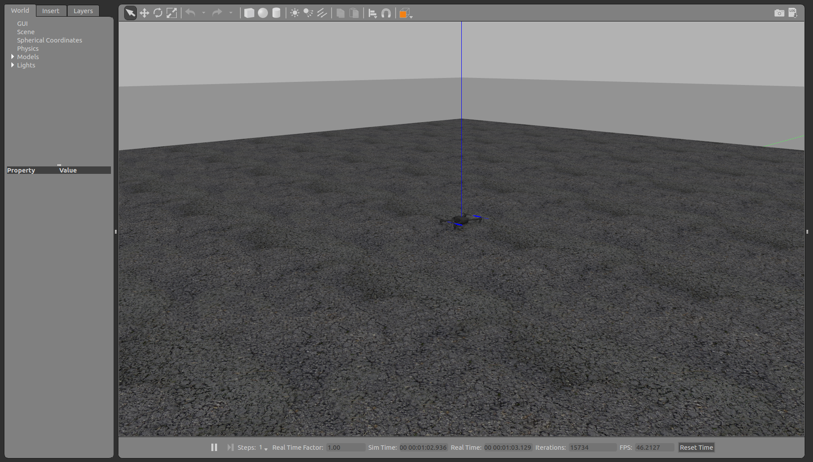

## PX4 and MAVROS

Now that we already have ROS and Gazebo installed and since in this project we do not plan on making any modifications to PX4 and MAVROS, these can directly be installed using the binaries. However, as there are no binaries for PX4, we will have to build that from source.

To install MAVROS(and the [GeographicLib](https://geographiclib.sourceforge.io/) dataset):

```bash
sudo apt-get install ros-kinetic-mavros ros-kinetic-mavros-extras
wget https://raw.githubusercontent.com/mavlink/mavros/master/mavros/scripts/install_geographiclib_datasets.sh
./install_geographiclib_datasets.sh
```

For the PX4 Firmware, there are a few things we need to set up:

1. [Remove modemmanager](https://dev.px4.io/en/setup/dev_env_linux_ubuntu.html#remove-the-modemmanager)
2. [Install the common dependancies](https://dev.px4.io/en/setup/dev_env_linux_ubuntu.html#common-dependencies)
3. [Install Ninja](https://dev.px4.io/en/setup/dev_env_linux_ubuntu.html#ninja-build-system)
4. [Install FastRTPS](https://dev.px4.io/en/setup/dev_env_linux_ubuntu.html#fastrtps-installation)

Now, it turns out that the instructions provided [here](https://dev.px4.io/en/simulation/ros_interface.html) do not set up our environment as required with ROS. A fix for this was proposed in [issue #66](https://github.com/PX4/Devguide/issues/66) in the PX4 repository which works perfectly.

1. Create a catkin workspace

    ```bash
    mkdir -p catkin_ws/src
    cd catkin_ws/src
    ```

2. Clone and get the submodules for the PX4 firmware

    ```bash
    git clone https://github.com/PX4/Firmware.git
    git clone https://github.com/PX4/sitl_gazebo.git
    cd Firmware
    git submodule update --init --recursive
    cd ..
    cd sitl_gazebo
    git submodule update --init --recursive
    cd ../..
    ```

3. Build and source the workspace

    ```bash
    catkin build
    source devel/setup.bash
    ```

{: .box-note}
**Note:** [Aliases](https://www.howtogeek.com/73768/how-to-use-aliases-to-customize-ubuntu-commands/) are pretty helpful shortcuts to source different workspaces.

If all of this went well without any errors, we have PX4 and MAVROS on our system. To test whether it works, after sourcing the workspace, run

```bash
roslaunch px4 mavros_posix_sitl.launch
```

Ideally this launches Gazebo and a simulated Iris drone with MAVROS as below:

