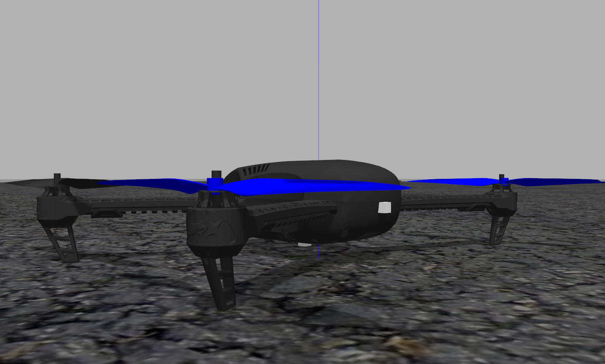
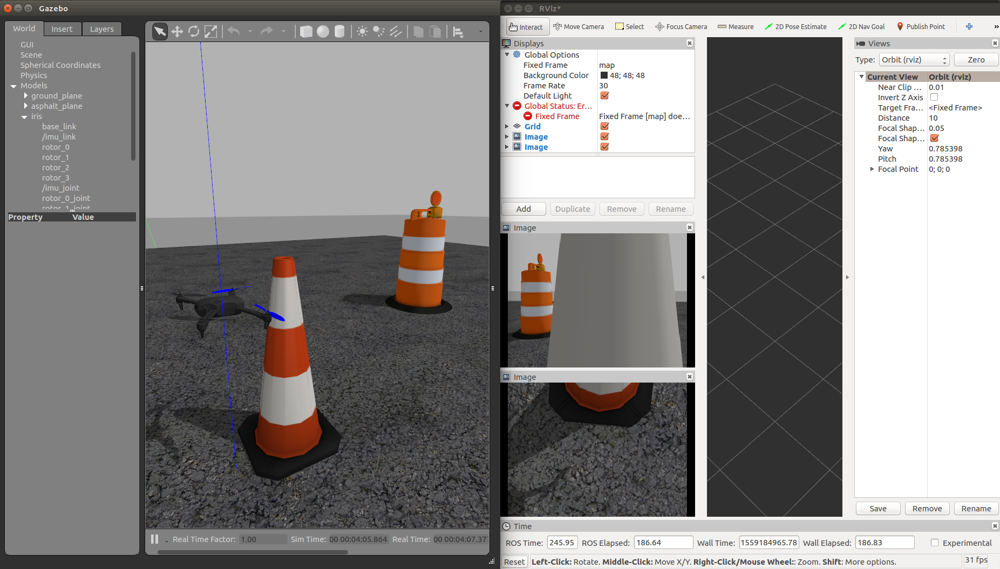

To create the models in gazebo, I thought that the models of the 3DR Solo and Iris made available in the [JdeRobot repository](https://github.com/JdeRobot/assets/tree/master/gazebo/models) could be used directly. Unfortunately, there is an issue in these files that does not allow the FCU (PX4) to connect to MAVROS.

```bash
[INFO] [1559168066.506380, 15.520000]: FCU not connected
[INFO] [1559168066.558471, 15.572000]: FCU not connected
[INFO] [1559168066.607304, 15.620000]: FCU not connected
[INFO] [1559168066.655244, 15.668000]: FCU not connected
[INFO] [1559168066.707429, 15.720000]: FCU not connected
[INFO] [1559168066.754438, 15.768000]: FCU not connected
```

This prompted me to create my own sdf file for both of these as incremental testing would allow me to find the bug easily. I also found that there already existed models in the PX4 repository for the 3DR Iris with the required camera [here](https://github.com/PX4/sitl_gazebo/tree/master/models/iris_fpv_cam). However, that is when I ran into the next problem. The exercises require the existence of two cameras - frontal and ventral. Of course, the logical method for this is to simply include the two cameras with different \<name\> and \<pose\> tags in the SDF file for the drone (Iris/Solo), but unfortunately there is no method for remapping the topic names in SDF (only [name, pose and static tags are parsed in SDF include tags](https://bitbucket.org/osrf/gazebo/src/eae3d1b7adce37b2838501a25e42d36966dce298/gazebo/sdf/interface/parser.cc?at=default#cl-634)). This, coupled with the fact that [PX4 is moving towards using URDFs, Xacros and RotorS](https://github.com/PX4/sitl_gazebo) and [this post](https://discuss.px4.io/t/how-to-add-a-ros-camera-to-iris-for-gazebo-simulation/5118/7) on the PX4 discussion page prompted me to use and modify the Xacros provided in the [PX4 SITL repository](https://github.com/PX4/sitl_gazebo/tree/master/models/rotors_description/urdf) for adding the two cameras.



Hence, after going through all the different [launch files provided in PX4](https://github.com/PX4/Firmware/tree/master/launch), I created my own [launch file](https://github.com/TheRoboticsClub/colab-gsoc2019-Nikhil_Khedekar/blob/master/catkin_ws/src/drone_exercises/launch/mavros_px4_sitl.launch) that parses the [3DR Iris Xacro](https://github.com/TheRoboticsClub/colab-gsoc2019-Nikhil_Khedekar/blob/master/catkin_ws/src/drone_exercises/models/rotors_description/urdf/iris_base.xacro) (with the newly added cameras) and launches it with MAVROS and PX4 SITL. This file shall be included in almost all other launch files. A video of the working code with the previous position controller (click the image to play):

[](http://www.youtube.com/watch?v=O2KT_7mCkpA)