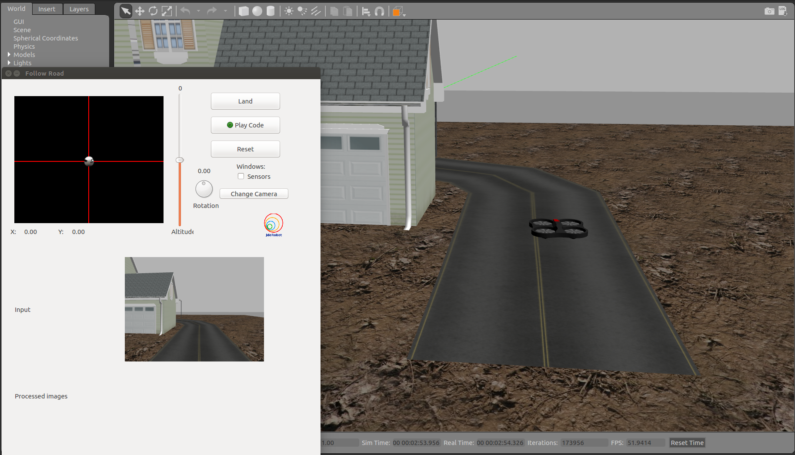
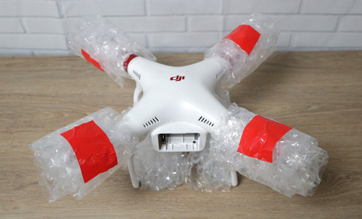

## RoboticsAcademy - Follow Road

The `follow-road` exercise is akin to a line follower with a drone. In this, a solution for the control of the AR-Drone is made using OpenCV to segment and find the alignment of the road while the JdeRobot API is used to send commands to the drone.



A solution for this exercise is required to verify the correct working of the exercise when ported to using the new backend: ROS, PX4 and MAVROS.

The [current solution](https://github.com/TheRoboticsClub/colab-gsoc2019-Nikhil_Khedekar/blob/master/exercises/follow_road/MyAlgorithm.py) was implemented in the following steps:

1. Using the [colorTuner](https://github.com/JdeRobot/base/tree/bef159bb6d9ab953815b89df775fa18dd63e1409/src/tools/colorTuner_py), the HSV region is found that best segments the road and background.
2. These values are used to [segment the recieved image](https://opencv-python-tutroals.readthedocs.io/en/latest/py_tutorials/py_imgproc/py_colorspaces/py_colorspaces.html#object-tracking) (after its [conversion from BGR to HSV](https://opencv-python-tutroals.readthedocs.io/en/latest/py_tutorials/py_imgproc/py_colorspaces/py_colorspaces.html#changing-colorspaces))
3. [Contours are found](https://opencv-python-tutroals.readthedocs.io/en/latest/py_tutorials/py_imgproc/py_contours/py_contours_begin/py_contours_begin.html#contours-getting-started) in the lower half of the image (as this solution utilizes the front camera of the drone flying at a very low altitude) and the longest contour, presumably representing the largest segment of visible road, is used to [fit an ellipse](https://opencv-python-tutroals.readthedocs.io/en/latest/py_tutorials/py_imgproc/py_contours/py_contour_features/py_contour_features.html?highlight=ellipse#fitting-an-ellipse).
4. The center of this ellipse is passed to a [proportional controller](https://en.wikipedia.org/wiki/Proportional_control) on the angular rate which is futher bounded by a maximum allowed angular velocity.
5. The drone is sent the result of the controller and a constant forward velocity using the JdeRobot API
6. The ellipse, its center, the selected contour and a central line are [drawn](https://opencv-python-tutroals.readthedocs.io/en/latest/py_tutorials/py_gui/py_drawing_functions/py_drawing_functions.html) for visualization purposes.

(Click on the image for the video)

[](http://www.youtube.com/watch?v=jTtvZt1WN2U "Video")

## MAVROS Exercise

The second task for this week was to make a ROS project using the new infrastructure (MavROS-based) to execute a complete closed trajectory (take off, hover, fly, hover, land at the take-off point) at a given height, just using relative speed commands (forward speeds, yaw rotation speeds).

The requirement presented by this task, though fulfilled by modifying the [offb_position_control](https://github.com/TheRoboticsClub/colab-gsoc2019-Nikhil_Khedekar/blob/master/catkin_ws/src/drone_exercises/src/offb_position_control.py) for [velocity control](https://github.com/TheRoboticsClub/colab-gsoc2019-Nikhil_Khedekar/blob/master/catkin_ws/src/drone_exercises/src/offb_velocity_control.py) and [further for an entire trajectory](https://github.com/TheRoboticsClub/colab-gsoc2019-Nikhil_Khedekar/blob/master/catkin_ws/src/drone_exercises/src/closed_trajectories.py) was a simple but hacky approach to verify the feasibility of velocity based control in the body frame.

The real requirement, for both, this task and all exercises is a class that will able to abstract all the functions of MAVROS and present something as simple as:

```python
drone = DroneWrapper(verbose=True)
drone.takeoff()
drone.set_cmd_vel(vx=1,az=1)
drone.land()
```

to fly in a circle (with appropriate sleep commands of course). For this, I present [DroneWrapper](https://github.com/TheRoboticsClub/colab-gsoc2019-Nikhil_Khedekar/blob/master/catkin_ws/src/drone_exercises/src/drone_wrapper.py) as a solution.



This class (built taking help from [previous work](https://github.com/TheRoboticsClub/colab-gsoc2019-Nikhil_Khedekar/blob/master/catkin_ws/src/drone_exercises/src/offb_position_control.py) and
[\[1\]](https://jderobot.org/Drones)
[\[2\]](https://github.com/szebedy/autonomous-drone)
[\[3\]](https://github.com/Jaeyoung-Lim/mavros_controllers)
[\[4\]](https://github.com/Jaeyoung-Lim/mavros_swarm)
[\[5\]](https://github.com/generalized-intelligence/GAAS/tree/master/demo/tutorial_5)
) provides a simple API for some of the various functions required in the exercises. The code for the task is made as simple as provided in [trial.py](https://github.com/TheRoboticsClub/colab-gsoc2019-Nikhil_Khedekar/blob/master/catkin_ws/src/drone_exercises/src/trial.py).

I plan to build upon this in the coming weeks to facilitate all the required functions by the exercises.

(Click on the image for the video)

[](http://www.youtube.com/watch?v=I9ERE0IjBeE "DroneWrapper Demo")
