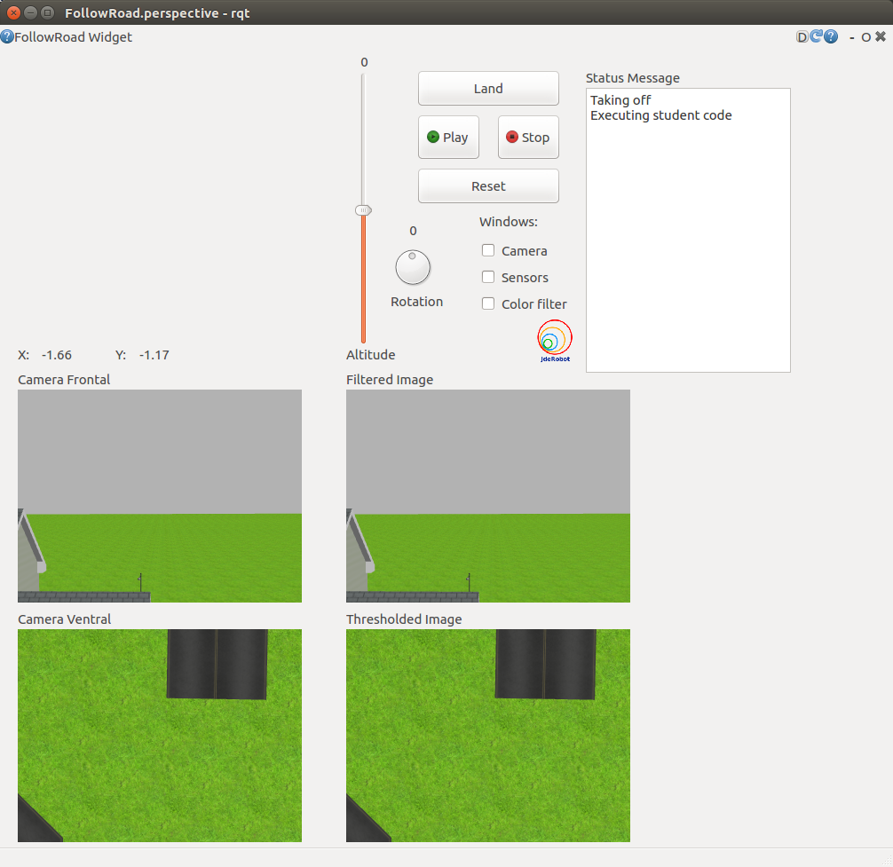

## 1: The proposal

As we all know, the easiest method for installing some software in Ubuntu is through `apt-get`. This is utilised to a great extent by the packages available through the [ROS build farm](http://wiki.ros.org/buildfarm). These packages, with the standard of `ros-<distro>-<packagename>` are easy to install and use. These are also managed through a continuous integration service called Jenkins. Though all this is good, as much as I read and understood from the information available, the packages released on the build farm take too much time to be made available to the users.

Another method of delivery is using PPA. The ROS packages packaged as debian packages under a PPA would be easily available to all the users and can be updated simply on each `sudo apt-get update && apt-get upgrade`.

An even simpler method would be to make these packages available on [http://jderobot.org/apt](http://jderobot.org/apt). This would require the minimum changes in the installation procedure. 

What I propose (atleast for the drone exercises) is that the GUI is made as one package in `rqt`, the required assets (launch files, models and worlds) are available in the JdeRobot-assets repository, `drone_wrapper` is distributed as a seperate ROS package and lastly, only the my_solution.py file is available in the JdeRobot-RoboticsAcademy.

An example:

1. `rqt_follow_road`
    Package containing the GUI and launch file for this exercise. This is to be distributed as `jderobot-rqt-follow-road` from [http://jderobot.org/apt](http://jderobot.org/apt)

2. `drone_wrapper`
    Package containing the helper class that abstracts MAVROS and PX4 for simplicity in usage. This is to be distributed as `jderobot-drone-wrapper` from [http://jderobot.org/apt](http://jderobot.org/apt)

3. JdeRobot/Assets
    - gazebo
        - models
            - iris_dual_cam/
        - worlds
            - follow_road.world
    The particular files and folders specified here are all that matter for the follow road exercise. Similar to it, all exercises shall have their own world file and launch file and will use the same `iris_dual_cam` model. This directory shall be installed on the student system by the current method of `sudo apt-get install jderobot-assets`. *I still need to figure out a way to allow roslaunch to find the launch files listed here so that the launch file can be distributed in the assets*

4. JdeRobot/RoboticsAcademy
    - exercises
        - follow_road
            - my_solution.py
            - README.MD
    The my_solution.py shall contain the students code that is envisioned to be run by the rqt itself by providing its path as an argument to the launch file.

### Proposed Usage

Assuming ROS and Gazebo is installed and source is added,

1. `sudo apt-get install jderobot-deps-dev jderobot-assets jderobot-drone-wrapper jderobot-rqt-follow-road`
2. `git clone git@github.com:JdeRobot/RoboticsAcademy.git`

Now that everything is installed

1. `roslaunch rqt_follow_road follow_road.launch path:=/home/username/Desktop/RoboticsAcademy/exercises/follow_road/my_solution.py`

And thats it. This shall fire up Gazebo, MAVROS, PX4, rqt GUI and the code.

The same can also be extended to the other exercises not involving drones i.e. A package for the GUI+ launch file, a package for the interfacing, the appropriately named assets and the my_solution.py in the RoboticsAcademy.

{: .box-note}
**Note:** So as it turns out, it is not possible to integrate the rqt_image_view into the a python plugin without [significant efforts of rewriting stuff](http://answers.ros.org/question/65174/how-docking-rqt_image_view-into-a-dashboard/). Thank the developers for [Pixmap](https://pythonspot.com/pyqt5-image/)!!

## 2: The Prototype

We have a prototype!! Thats exactly what it is. A prototype.

### [`drone_wrapper`](https://github.com/TheRoboticsClub/colab-gsoc2019-Nikhil_Khedekar/tree/master/catkin_ws/src/drone_wrapper)

This is the base package for all drone exercises and contains:

1. The DroneWrapper class (to be imported into my_solution.py)
2. The launch file for MAVROS, PX4 SITL and Gazebo (iris is expected to be present in the world file)
3. A simple bash script to run the my_solution.py file wherever it is (when its complete path is given as a parameter to the launch file)

### [`rqt_follow_road`](https://github.com/TheRoboticsClub/colab-gsoc2019-Nikhil_Khedekar/tree/master/catkin_ws/src/rqt_follow_road)

This package is the logic for the GUI of the exercise and also contains the launch file.

{: .box-note}
**Note:** *The launch file is to be moved to the assets directory as soon as I figure out how to roslaunch it safely from there.

{: .box-note}
**Note:** I am trying to implement the 2D slider as is but incase that does not work out, I shall use two sliders instead (as is [suggested in rqt_robot_steering](http://wiki.ros.org/rqt_robot_steering))*

### [`my_solution.py`](https://github.com/TheRoboticsClub/colab-gsoc2019-Nikhil_Khedekar/blob/master/catkin_ws/src/drone_exercises/src/my_solution.py)

This file is expected to be distributed in the Robotics Academy. This instantiates a Drone and provides the student a simple method to call the requisite functions.

### A demo of the above

