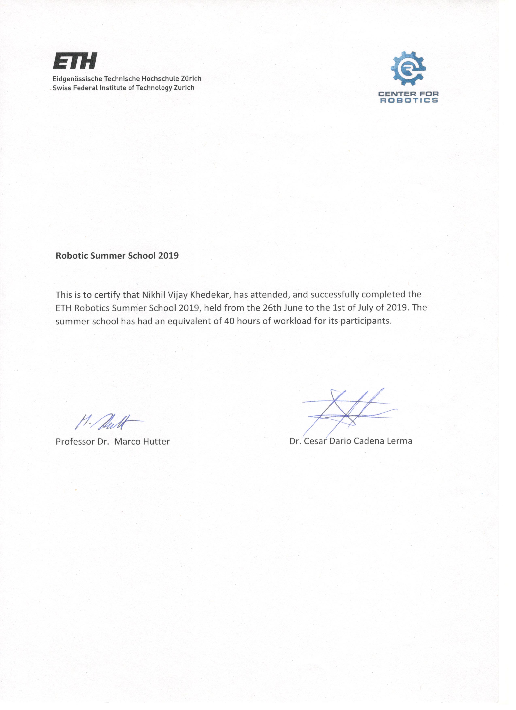

## ETH Zurich Robotics Summer School

I am pleased to announce my successful participation in the ETH Zurich Robotics Summer School from 26th June to 1st July and Advanced Robotic Capabilities for Hazardous Environments (ARCHE) Event from 2nd July to 5th July. I am extremely grateful to my mentors for allowing me to restructure my deliverables for the same :D

I would also like to announce that my team emerged victorious in the competition held at the end of the Summer School and ARCHE Event that was based on the course content in a search and rescue scenario.

## Restructuring of Code

As I would be travelling from Pune to Zurich and back, this "week"'s task was to restructure the code into a seperate [drones repository](https://github.com/JdeRobot/drones) that can be used to create a deb package to be installed only by the students interested in doing the drone exercises. This is complete barring one small snag - DroneWrapper does not seem to be visible to the my_solution.py file. I am currently trying to fix this and there shall soon be a [pull request for the new version](https://github.com/nkhedekar/JdeRobot-RoboticsAcademy/commit/be59e56b3297bedfdd3599a664a9a2abf9246bb8) for the Robotics Academy.

### Update

May god bless Simon Birrell for [this awesome article](http://www.artificialhumancompanions.com/structure-python-based-ros-package/) he has written. Through this, I was able to solve the above issue and the pull request has now been [created](http://www.artificialhumancompanions.com/structure-python-based-ros-package/). The work on this is not done yet though. As the `jderobot-drones` package still needs to be created and released and the color calibration tool still needs to be ROSified for the request to be merged.
