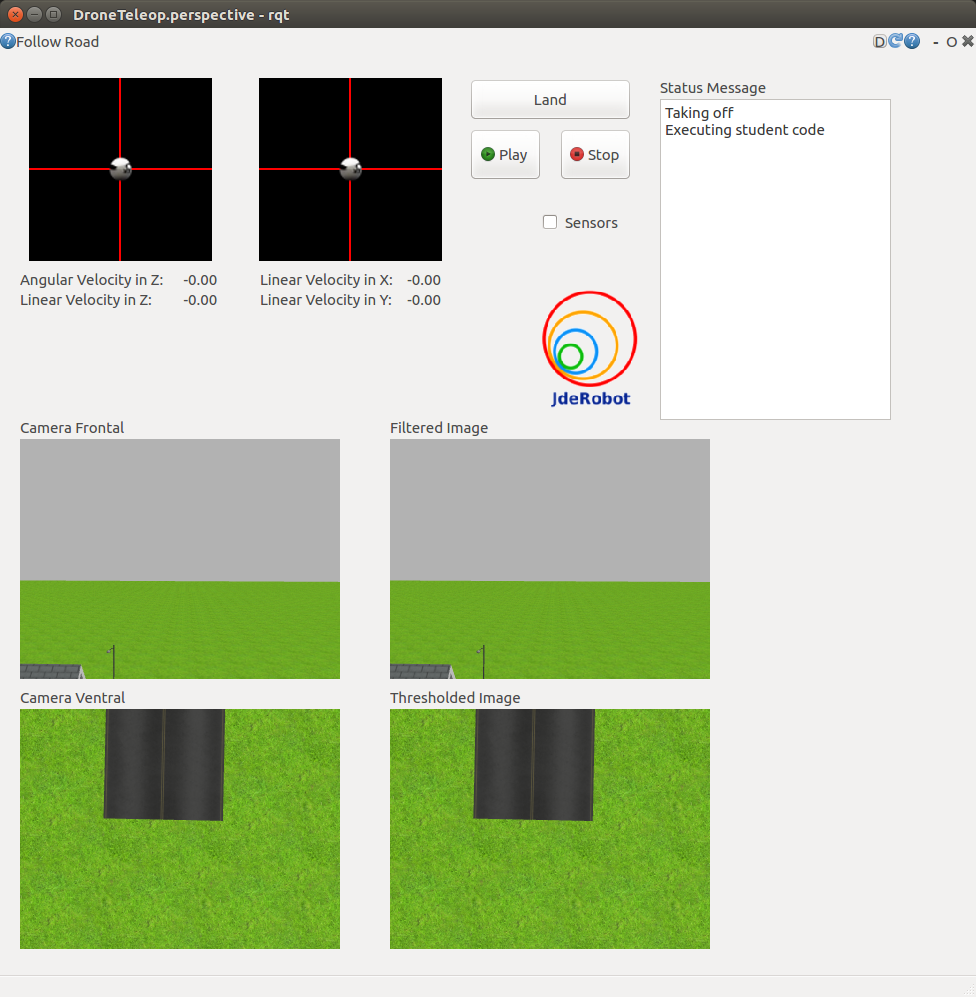

As it happens, the GUI interface for interacting with the drones is pretty similar for almost all the exercises (I took my time to realize this). Once I realized this, instead of having a seperate rqt_** package for each exercise, it made sense to have one common [rqt_drone_teleop](https://github.com/JdeRobot/drones/commit/b5fdff3950962a29efda2a388ead46c35bce0221) package and a launch file in every exercise directory.

As the [rqt_joystick provided here](https://github.com/jinahadam/RQT-Joystick) seemed to have several errors and there being no other candidate for a simple import of a Mode 2 controller UI, I modified the code of the old PyQT5 teleop widget to allow for dynamic sizing and parent function calling (of course there must be better terms for this). This way, I was able to get multiple instances in the UI as seen above. After some more modifications, the sensors can also now be shown using the checkbox.

The working code has now been put up in the [drones repository](https://github.com/JdeRobot/drones). The new format, only requires the README.md, my_solution.py and a launch file in the exercise directory. With these modifications done for two exercises, I have made a pull request for both of them [here](https://github.com/JdeRobot/RoboticsAcademy/pull/313) and [here](https://github.com/JdeRobot/RoboticsAcademy/pull/315)!

(This also required a new world file to be created for the labyrinth exercise which has been put up as a [pull request in the assets repository](https://github.com/JdeRobot/assets/pull/24))
