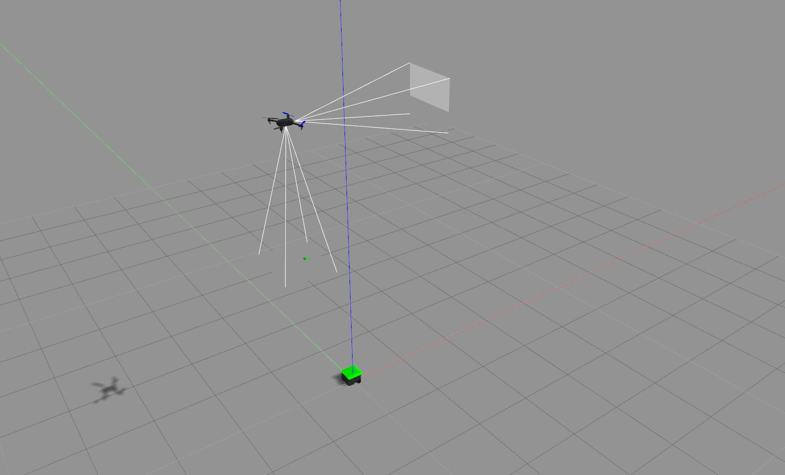
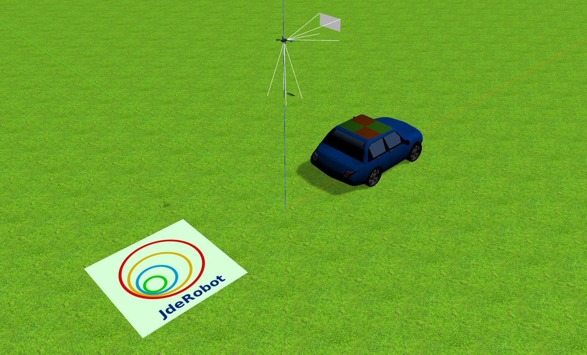

This week focused on getting multi agent exercises to work (the simple ones of course). This was the [follow_turtlebot](https://github.com/JdeRobot/RoboticsAcademy/tree/drone_mods/exercises/follow_turtlebot) exercise (Completed with a turtlebot3) and the [visual_lander](https://github.com/JdeRobot/RoboticsAcademy/tree/drone_mods/exercises/visual_lander) exercise (Completed with the fixed model). Since both of these exercises required a GUI for the teleoperation of the ground, I also developed the [rqt_ground_robot_teleop](https://github.com/JdeRobot/ground_robots/tree/master/rqt_ground_robot_teleop) for this purpose.

The source of the major time drain was the visual lander exercise. As we are making efforts to have everything as standardised as possible, the custom plugin for something as simple as a car just would not do. I searched quite a bit, and then some for a good, maintained model but alas, the model that has been released by [osrf](https://github.com/osrf/car_demo) is unfortunately only compatible gazebo 9 onward.

Continuing my efforts to find some standard model, I even tried using the Clearpath Husky simulation, however, they seem to have updated their models beyond the direct compatibility of gazebo 7 and require changes to the model files which essentially destroyes the purpose.

The solution that I have put at the moment uses the old model but with the standard planar motion plugin instead of the custom plugin. This, even though it works is not the ideal solution but may be the best we can do without a custom plugin.

There do exist models of vehicles but they contain several unnecessary sensors that slow down the simulations(The same problem was noticed in the Husky). As per the requirements in the other exercises for ground robots, it would make sense to have a single base model with basic movement functionality which can be instantiated with the required sensors (Taking inspiration from the husky). I am currently looking into the possibility of this through the osrf model.

## Update on packages

The discussion for the package release can be found on [ROS discourse here](https://discourse.ros.org/t/preparing-for-kinetic-sync-2019-07-22/10015/6) and the sync shall mostly be taking place tomorrow.

After confirming the workings of the last two exercises, I plan on releasing all new changes also into the same packages. I also plan to release the rqt_ground_robot_teleop simultaneously.
