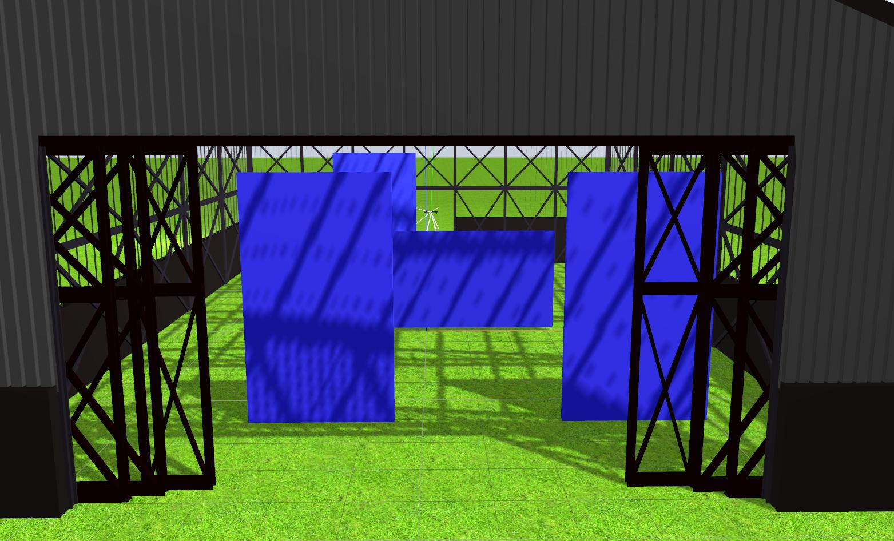

The [drone_hangar](https://github.com/JdeRobot/RoboticsAcademy/tree/drone_mods/exercises/drone_hangar) exercise has also been rosified. Unfortunately, it was required to have the custom plugins that were created for the walls. This of course deviates from the "no custom plugins" but in this case, it was unavoidable.

This leaves us only with the single exercise - drone_cat_and_mouse. Apart from these, to ensure that the repositories I have contributed to can be maintained by other people also, I shall be adding instruction documents for the same in the respective repositories. This as well as the final pull from the `drone_mods` branch onto the `master` branch in the Robotics Academy repository must be completed by the 19th as per the mail from Google which I don't forsee to be an issue.

## Update on packages

The first version of the `jderobot-assets` package has been released through official sources and now the package can be downloaded and installed through the simple command of `sudo apt-get install ros-kinetic-jderobot-assets`. The other packages - `rqt_drone_teleop` and `drone_wrapper` did not build earlier due to an issue in the CMakeLists.txt. This has now been fixed and all builds are passing. These shall be integrated into the next sync.
