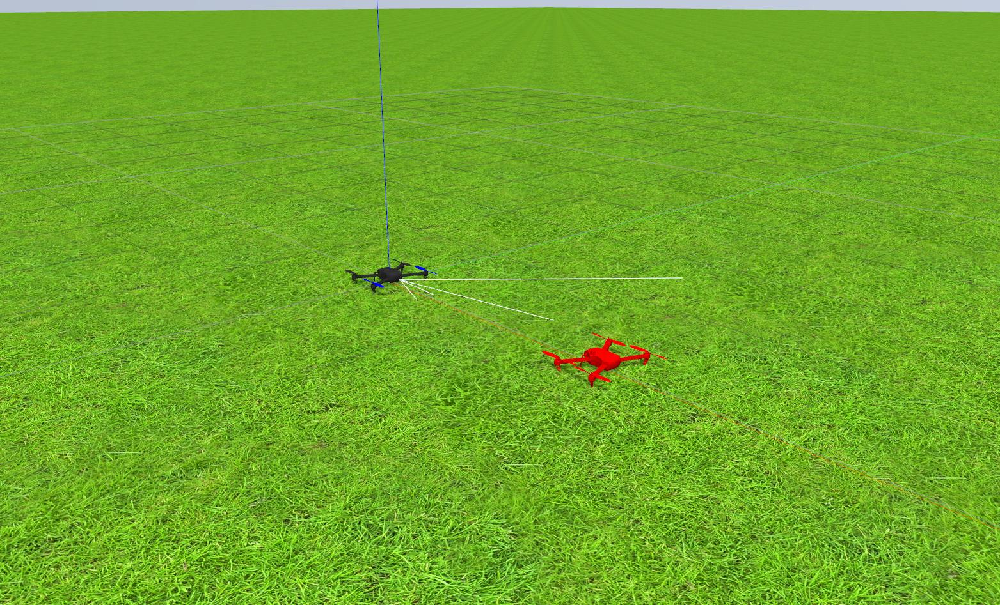

## Drone Cat and Mouse

Turns out that writing good code is difficult. Who could have thunk?

There are several changes required in the code of all the packages to accomodate multiple drones in one exercise. This includes the addition of a config file for the proper remapping, addition of custom perspective for direct usage and huge changes in the launch files among many others. The most important change dictated for using multiple drones is that they cannot be added through the world file. This is due to the fact that the port numbers for communication are defined in the sdf and sdfs are not parametrized, as opposed to xacros (and in some cases urdfs). Fortunately someone already thought of this problem and created a launch file to edit the sdf before instantiation for spawning multiple models in PX4 SITL.

Another very important pointer for good code is similar structure across the board. For having this, world and launch files of all the exercises needed a bit of modification to use the spawning of the drone for their execution. The benefit of the new structure is that it will be much easier to add exercises with multiple drones.

## Videos

The video of the new Follow Road exercise has been published and the code has been updated in the RoboticsAcademy-extra repository.

## Packages

All three packages have now been released and are installable through apt-get.

## Plugins

Following the last discussion, the plugins have been removed from the assets and after the currently ongoing base modifications are done, we shall create a proper ros package released through ROS for the base as well.

## Final week implications

What this leaves for the final week is a very busy student.

To do:

* Translation of mouse from cpp to python
* Creation of param files for the cat and mouse exercise
* Reconfiguring of rqt_drone_teleop and drone_wrapper for getting topics and services from param files
* Further reconfiguration of launch files
* ROSification of the referee
* ROSification of the solutions in RoboticsAcademy-extra
* Uploading of videos
* Release of rqt_ground_robot_teleop

## Other Important stuff

Over the weekend I was awarded my degree in the convocation in Goa. I will also be leaving for Reno on the 18th.
